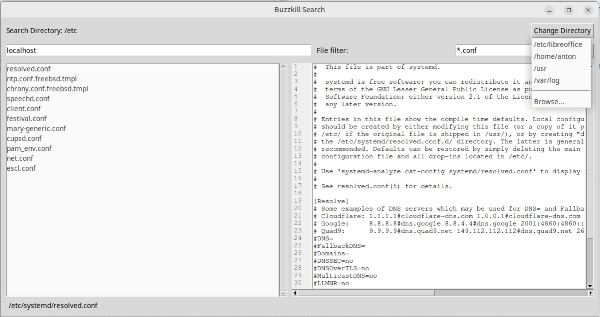

# Buzzkill Search

**Disclaimer**: All code in this project is written by Cursor AI. The project is licensed under the MIT License.

Buzzkill Search is a fast and efficient file search utility that allows you to quickly find files containing specific text. It features a modern GUI with real-time search results and file content preview.

## Features

- Real-time file search as you type
- File content preview with line numbers
- Support for binary file detection
- Recent directories feature
- Modern and responsive GUI
- Cross-platform support (Windows, Linux, macOS)

## Screenshots




## Installation

### From PPA (Ubuntu)

```bash
sudo add-apt-repository ppa:antonziminsaritasa/buzzkill-search
sudo apt update
sudo apt install buzzkill-search
```

### From Source

1. Clone the repository:
   ```bash
   git clone https://github.com/yourusername/buzzkill-search.git
   cd buzzkill-search
   ```

2. Install dependencies:
   ```bash
   pip install -r requirements.txt
   ```

3. Run the application:
   ```bash
   python3 buzzkill_search.py
   ```

## Usage

1. Launch Buzzkill Search
2. Select a directory to search in using the directory picker
3. Enter your search term in the search box
4. Results will appear in real-time as you type
5. Click on a file to preview its contents
6. Double-click a file to open it in your default application

## Files Created by Human

- `.gitignore`
- `prompts.md`
- `2025-03-27_145518.png`
- `2025-03-28_154527.png`

## License

This project is licensed under the MIT License - see the [LICENSE](LICENSE) file for details. 