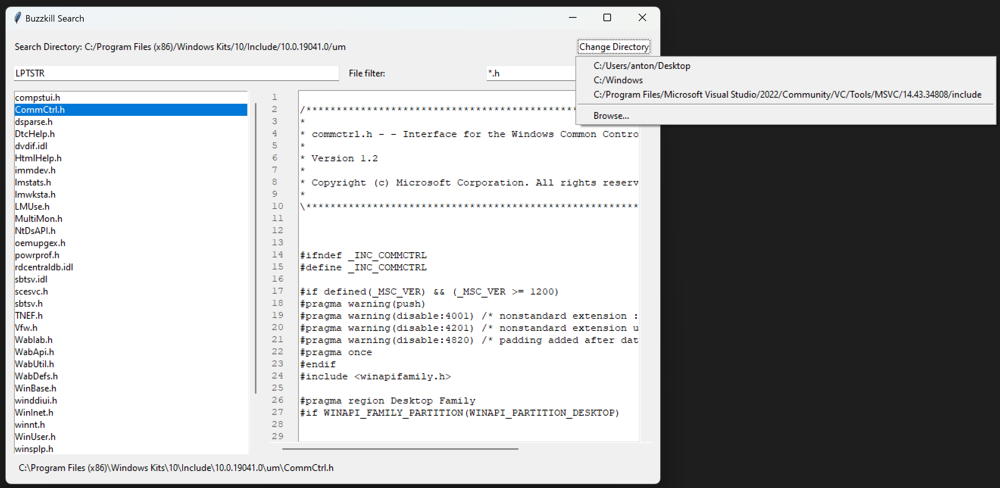

# Buzzkill Search

A fast file search utility with a modern UI.



## Features

- Fast file search using parallel processing
- File content preview with line numbers
- File name filtering with glob patterns
- Recent directories list
- Binary file detection
- Support for various text encodings
- Responsive UI with proper error handling

## Requirements

- Python 3.6 or higher
- tkinter (usually comes with Python)
  - On Ubuntu/Debian: `sudo apt-get install python3-tk`
  - On Fedora: `sudo dnf install python3-tkinter`
  - On Arch Linux: `sudo pacman -S tk`

## Installation

1. Clone this repository or download the files
2. No additional dependencies required - uses only Python standard library

## Usage

Run the program:
```bash
python3 buzzkill_search.py
```

### File Filter Examples

- `*.txt` - Search only text files
- `*.py` - Search only Python files
- `*config*` - Search files with "config" in the name
- `*.{txt,md}` - Search both .txt and .md files

## Disclaimer

All code in this project is written by Cursor AI. The project is licensed under the MIT License.

Note: The following files were created by a human:
- `.gitignore`
- `.prompts.md`
- `2025-03-27_145518.png` 